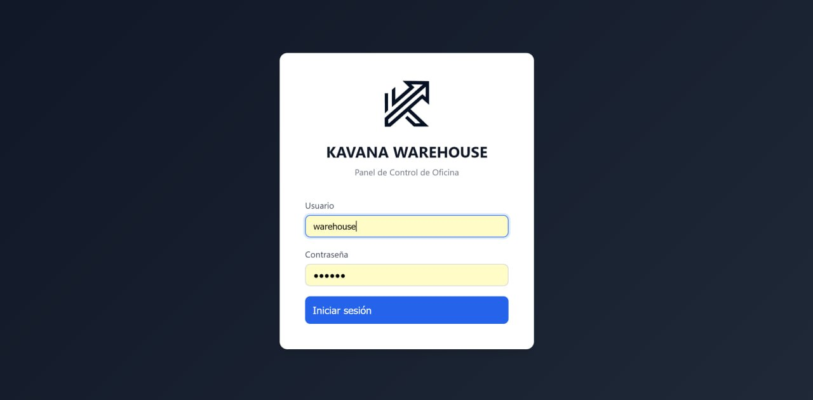
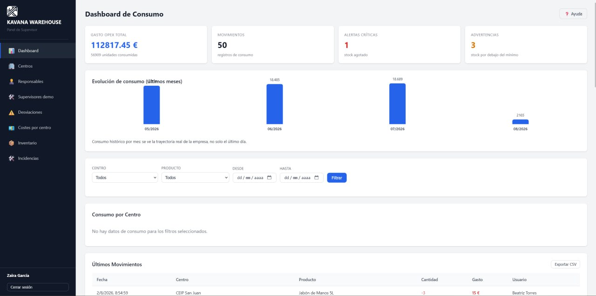
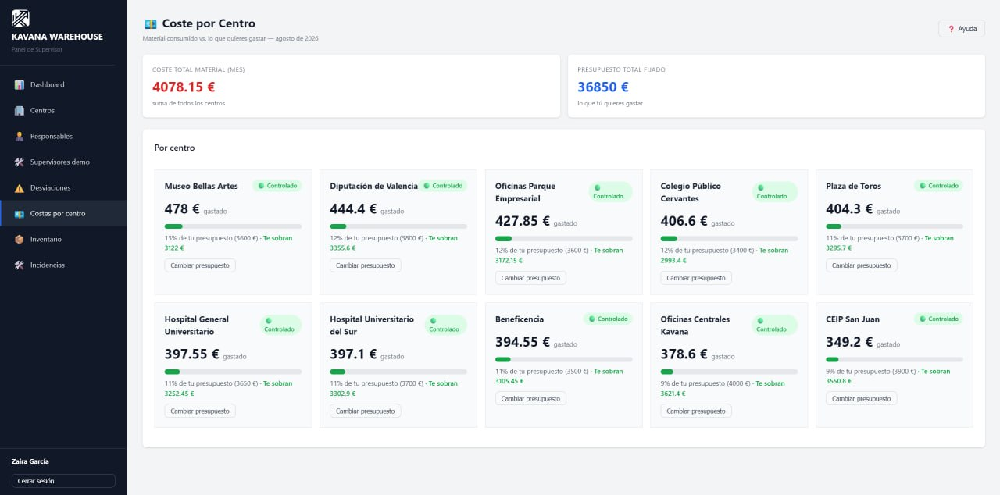
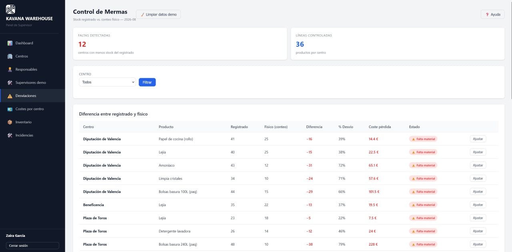
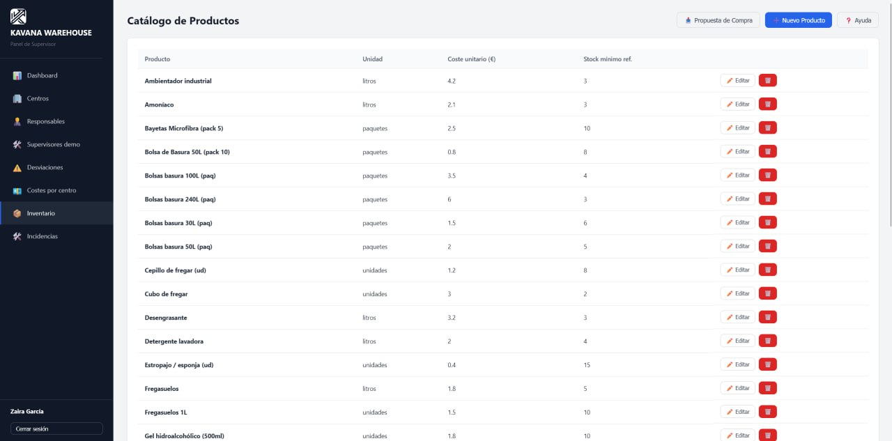
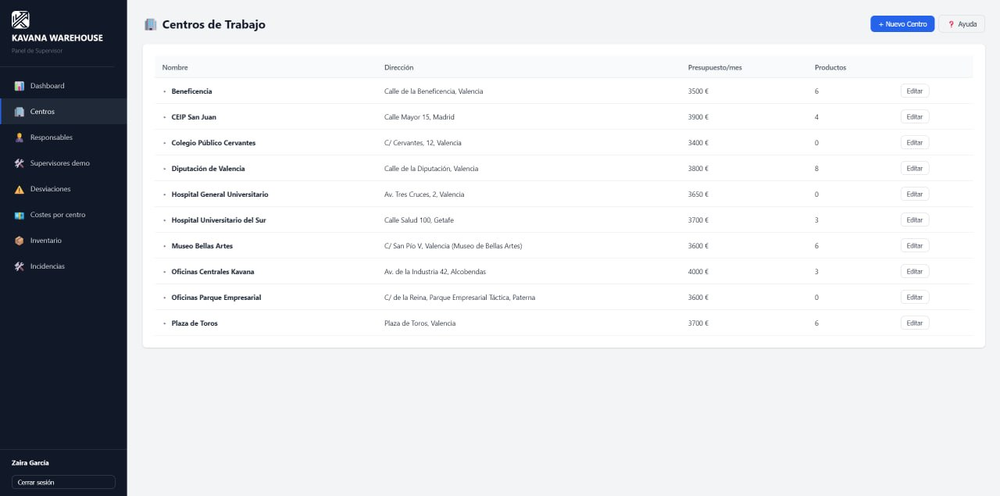

# KAVANA WAREHOUSE

> **Control de stock multi-tenant para empresas de limpieza con múltiples centros. Consumo por centro, alertas de stock bajo y control de presupuesto en una sola plataforma.**


---

## ⚡ 30 Segundos

Kavana Warehouse es una plataforma web para empresas de limpieza que operan en varios centros (colegios, oficinas, hospitales). La oficina sabe qué producto se consume en cada centro, cuándo baja de stock y cuánto se gasta respecto al presupuesto mensual. Nació del problema real de una empresa de limpieza de Valencia que no sabía cuánto material gastaba cada centro.

La demo pública simula una empresa viva con 3 meses de histórico (10 centros, 31 productos, ~31.000 movimientos) y evoluciona sola cada día.

---

## 🏗️ Arquitectura

```
          Oficina / Supervisor
                    │
                    ▼
          Dashboard web (React 19)
                    │
                    ▼
            API REST (Express)
                    │
            JWT + RBAC (2 roles)
                    │
              Prisma ORM
                    │
            PostgreSQL 16 (Neon)
```

- **Multi-tenant shared schema**: aislamiento lógico por `client_id` en todas las queries.
- **Despliegue**: frontend en Vercel, API en Render, BD en Neon (serverless).
- **Demo viva**: un cron diario simula el consumo de los limpiadores (baja el stock, suben los costes, aparecen alertas solas).

---

## 🧠 Decisiones clave

| Decisión | Alternativas | Elegida | Por qué |
|----------|-------------|---------|---------|
| Multi-tenancy | Schema-per-tenant, RLS | Shared schema + `client_id` | Simple y suficiente para el dominio (ADR-001) |
| Auth | Sesiones en servidor, JWT largo | JWT corto + refresh tokens | Stateless, sesiones revocables sin Redis (ADR-002) |
| ORM | SQL raw, Knex | Prisma | Type-safety de extremo a extremo, migraciones declarativas (ADR-003) |
| Roles | 4 roles, app móvil | 2 roles: `oficina` + `supervisor` | La app evolucionó a gestión de stock pura; menos roles, menos fricción |
| BD | Supabase, VPS | Neon serverless | IPv4 nativo, compatible con Render free |
| Deploy | VPS, serverless | Vercel + Render + Neon | Coste cero, auto-deploy por push, demo viva (ADR-004) |
| Migraciones | En el start | Manuales | `migrate deploy` en el arranque rompía los deploys |
| Asistente técnico | Embeddings + pgvector, OpenAI API | TF-IDF en memoria + modelo gratuito de OpenRouter | Corpus < 100 KB: sin vector DB, gratis, honesto (ADR-005, ADR-006) |
| Blindaje demo | Bloquear todo a visitantes | `officeOnly`: visita = lectura + recuento | El supervisor de visita (24h) no gestiona ni resetea la demo (ADR-005) |

> Todas las decisiones consolidadas con detalle en [`DECISIONS.md`](DECISIONS.md) (6 ADRs + decisiones de implementación).

---

## 💰 Cómo está construido y cómo lo construiría con presupuesto

KAVANA Warehouse es una demo con **un solo usuario real (su autor)** y coste objetivo de **0 €/mes**. No es una carencia disimulada: es una restricción elegida, y cada punto de abajo lleva al lado qué cambiaría con usuarios reales y presupuesto. El detalle con alternativas está en el [ADR-006](docs/adr/006-coste-cero-y-modelos-gratuitos.md).

- **Asistente técnico:** recuperación por **TF-IDF en memoria** (sin embeddings ni base vectorial, coste 0) y un **modelo gratuito** de OpenRouter para redactar. Medido con la misma pregunta: **11,2 s** frente a los 26,3 s del modelo de pago que usaba antes. Con usuarios reales: modelo de pago con SLA y modelo de respaldo, y búsqueda semántica con embeddings si el corpus crece.
- **Base de datos:** Neon serverless en nivel gratuito (escala a cero, IPv4 nativo). Con usuarios reales: plan con restauración amplia, réplicas de lectura y copias gestionadas.
- **Cómputo:** Vercel para el front y Render free para la API (una instancia, arranque en frío). Con usuarios reales: instancias dedicadas y autoescalado.
- **Demo y datos:** datos de sesión con caducidad de 24 h y un supervisor de visita que no puede gestionar ni resetear (ADR-005). Con usuarios reales: tenants reales aislados, auditoría de accesos y borrado garantizado.
- **Migraciones:** `migrate deploy` manual, nunca en el arranque (en el arranque rompía los despliegues). Con usuarios reales: pipeline de migraciones con ventana, verificación y vuelta atrás.
- **Secretos y límites:** variables de entorno en el proveedor y límite de peticiones en la API. Con usuarios reales: gestor de secretos con rotación y cuotas por usuario y plan.

Lo que **no** cambia entre los dos escenarios es lo que se evalúa aquí: multi-tenancy por `client_id` verificada con tests, autenticación con JWT corto y refresh revocable sin Redis, roles reducidos a lo que el dominio necesita, blindaje de la demo probado y documentación que no miente sobre lo que hay.

---

## 📊 Estado

| Funcionalidad | Estado |
|--------------|:------:|
| Login por usuario o email (tolerante a mayúsculas/espacios) | ✅ |
| Dashboard con KPIs y evolución mensual | ✅ |
| Gestión de centros, productos e inventario | ✅ |
| Costes por centro vs presupuesto | ✅ |
| Alertas de stock bajo | ✅ |
| Desviaciones (stock registrado vs físico) | ✅ |
| Recuentos físicos del supervisor | ✅ |
| Propuesta de compra | ✅ |
| Incidencias | ✅ |
| Supervisores demo (caducan a las 24h) | ✅ |
| Asistente técnico RAG (responde con la documentación real) | ✅ |
| Blindaje demo (visitante no gestiona ni resetea datos compartidos) | ✅ |
| Multi-tenant verificado con tests | ✅ |
| CI/CD (GitHub Actions) | ✅ |
| 45 tests de API + 3 tests de frontend | ✅ |
| App móvil | ❌ Descartada (gestión de stock web) |

---

## 📚 Documentación

| Documento | Descripción |
|-----------|-------------|
| `DECISIONS.md` | Consolidación de todas las decisiones (ADRs + implementación) |
| `docs/adr/` | Architecture Decision Records (4) |
| `docs/technical/` | Arquitectura, despliegue, auditoría, roadmap |
| `docs/commercial/` | Documentación de producto y plan de mejoras |
| `docs/deployment.md` | Despliegue real (Vercel + Render + Neon) y credenciales demo |

---

## 🚀 Cómo ejecutar

```bash
cp .env.example .env       # configura DATABASE_URL, JWT_SECRET
docker compose up -d       # levanta db + api + dashboard
npm install
npx prisma migrate deploy  # aplica migraciones (nunca en el start)
npm test                   # 35 tests
```

---

## 🌐 Demo

- **Landing portfolio**: https://www.kavanasystems.com/warehouse/
- **Aplicación**: https://warehouse.kavanasystems.com
- **Usuario demo**: `warehouse` · **Contraseña**: `kavana`

## 📸 Capturas reales

Capturas de la demo desplegada (no mockups): cada pantalla corresponde al código de este repositorio.

#### Login


#### Dashboard (KPIs, evolución mensual, alertas)


#### Costes por centro (presupuesto vs consumo)


#### Desviaciones (stock registrado vs conteo físico)


#### Inventario multi-centro


#### Gestión de centros


> También se muestran en la landing: https://www.kavanasystems.com/warehouse/#capturas

---

## 📄 Licencia

MIT © 2026 [Jorge Adán Rodríguez](https://www.kavanasystems.com) · Kavana Systems
